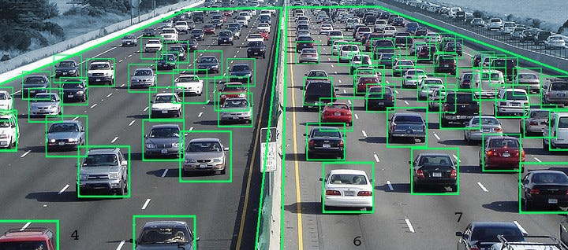

 

<h1 align="center">Traffic Optimization Using AI</h1>

<h4>This project leverages AI and Computer Vision to optimize traffic signals at intersections. The system uses YOLO for vehicle detection and adjusts signal timers dynamically, reducing congestion, delays, and fuel consumption.</h4>

-----------------------------------------
### Inspiration

- Traffic congestion is a critical issue, especially in rapidly urbanizing regions. Delays and traffic jams waste time, increase stress, and elevate fuel consumption and pollution levels.
- Indian cities like Mumbai, Bengaluru, and Delhi are among the most traffic-congested globally (source: [TomTom Traffic Index](https://www.tomtom.com/en_gb/traffic-index/ranking/)).
- To address this, we propose a vision-based traffic light controller that adapts signal timings dynamically based on real-time traffic density, ensuring better traffic management.

------------------------------------------

## Objectives
- Identify factors contributing to traffic congestion at signalized intersections.
- Develop an adaptive traffic signal control system using AI for dynamic traffic optimization.
- Reduce delays, fuel consumption, and environmental pollution.

## Methodology
- **Vehicle Detection**: Utilized YOLO for real-time detection of vehicles, classifying them into various types like cars, bikes, buses, and rickshaws.
- **Signal Timing Optimization**: Designed algorithms to adjust green signal timings dynamically based on real-time traffic density.
- **Simulation**: Developed Python-based simulations to compare adaptive and static traffic systems.

## Technologies Used
- **Python**: For developing algorithms and simulations.
- **YOLO (You Only Look Once)**: For real-time object detection.
- **Pygame**: For visualizing traffic simulations.

## Results
- The adaptive system demonstrated a **23% improvement** in vehicle throughput compared to the static system.
- Significant reduction in idle time and waiting time for vehicles.

### Implementation Details

This project is divided into three key modules:

1. **`Vehicle Detection Module`**:
   - Detects and classifies vehicles in real-time using YOLO.
   - Identifies different classes such as cars, bikes, buses, trucks, and rickshaws.

2. **`Signal Switching Algorithm`**:
   - Dynamically adjusts red, green, and yellow signal timings.
   - Factors in vehicle counts, class types, lane numbers, and average speeds.

3. **`Simulation Module`**:
   - Simulates traffic intersections using the [Pygame](https://www.pygame.org/news) library.
   - Visualizes real-time traffic flow and the impact of adaptive signal control.

Read the complete project details in the [documentation](./docs/Project_Report.pdf).

------------------------------------------
### Demo

#### `Vehicle Detection`
The YOLO-based vehicle detection system identifies and classifies vehicles in real time.

   

#### `Signal Switching Algorithm and Simulation`
A simulation visualizing the adaptive signal control based on traffic density.

   

------------------------------------------
### Prerequisites

1. [Python 3.7](https://www.python.org/downloads/release/python-370/)
2. [Microsoft Visual C++ build tools](http://go.microsoft.com/fwlink/?LinkId=691126&fixForIE=.exe.) (Windows only)

------------------------------------------
## How to Run
1. Clone the repository.
2. Install required dependencies from `requirements.txt`.
3. Run the scripts in the `Code` directory to test the adaptive traffic signal system and view simulations.

### License
This project is licensed under the MIT License. See the [LICENSE](./LICENSE) file for details.

### About the Author
This project was conceptualized, developed, and implemented by **RaghuNath Reddy**. It showcases AI-driven solutions for real-world traffic optimization challenges.
